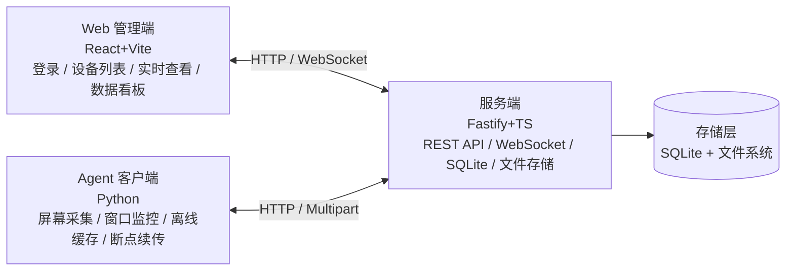

# 架构设计

## 1. 项目简介

员工桌面监控软件 MVP，包含客户端采集 Agent、服务端与 Web 管理端三部分，用于采集员工桌面截图与活动窗口数据，集中存储与分发，并通过 Web 端提供实时查看与数据看板，服务于工时统计与效率分析场景。

## 2. 整体架构图

```
+-------------------+      +-------------------+      +-------------------+
|   Web 管理端      |      |   服务端          |      |   Agent 客户端    |
|   (React+Vite)    |<---->|   (Fastify+TS)    |<---->|   (Python)        |
|   - 登录          | HTTP |   - REST API      | HTTP |   - 屏幕采集      |
|   - 设备列表      |  WS  |   - WebSocket     |  Multipart| - 窗口监控  |
|   - 实时查看      |      |   - SQLite        |      |   - 离线缓存      |
|   - 数据看板      |      |   - 文件存储      |      |   - 断点续传      |
+-------------------+      +-------------------+      +-------------------+
                                   |
                           +-------+-------+
                           |   存储层      |
                           |   - SQLite    |
                           |   - 文件系统  |
                           +---------------+
```

### Mermaid 版本



## 3. 模块说明

### 3.1 服务端（`server/`）

- **入口**：`src/index.ts`
- **框架**：Fastify 4.x
- **存储**：SQLite（better-sqlite3，文件位于 `server/data/app.db`）
- **截图存储**：本地文件系统 `server/data/screenshots/{deviceId}/{date}/`
- **鉴权**：JWT
  - 管理员使用独立 `JWT_SECRET` 签发
  - Agent 使用独立 secret，支持单独吊销（通过 `agents` 表的 `revoked` 字段控制）
- **端口**：默认 3000（可通过 `PORT` 环境变量修改）
- **依赖插件**：`@fastify/cors`、`@fastify/multipart`、`@fastify/websocket`、`@fastify/static`

### 3.2 客户端 Agent（`agent/`）

- **入口**：`src/main.py`
- **平台**：仅支持 Windows（依赖 `pywin32` 调用 Windows API）
- **依赖**：mss、Pillow、pywin32、requests、websocket-client、python-dotenv
- **本地数据库**：SQLite（Python 标准库 `sqlite3`，文件位于 `agent/data/agent.db`）
- **采集间隔**（均可在 `.env` 配置）：
  - 截图采集 `SCREENSHOT_INTERVAL`：默认 30 秒
  - 窗口采样 `WINDOW_SAMPLE_INTERVAL`：默认 1 秒
  - 事件聚合 `EVENT_AGGREGATE_INTERVAL`：默认 30 秒
  - 上传轮询 `UPLOAD_INTERVAL`：默认 60 秒
- **开机自启**：Agent 启动时自动写入注册表 `HKCU\Software\Microsoft\Windows\CurrentVersion\Run`
- **离线缓存与断点续传**：网络中断时数据写入本地 `pending_events`、`pending_screenshots` 表，恢复后按时间顺序续传

### 3.3 Web 管理端（`web/`）

- **入口**：`src/main.tsx`
- **框架**：React 18 + Vite 5
- **UI 库**：Ant Design 5
- **路由**：react-router-dom 6
- **图表**：Recharts
- **HTTP 客户端**：axios
- **端口**：开发模式 5173（Vite 默认），生产构建后通过任意静态文件服务器或由服务端 `@fastify/static` 托管

## 4. 数据流

### 4.1 采集流程（离线上报）

```
Agent 采集（截图 / 窗口）
      ↓
本地 SQLite 队列（pending_events / pending_screenshots）
      ↓
上传器轮询取出（按时间顺序）
      ↓
HTTP POST /api/agent/events、/api/agent/screenshots
      ↓
服务端落盘（截图） + 入库（events / screenshots 表）
```

### 4.2 实时流程（WebSocket 推送）

```
Agent 截图上传 POST /api/agent/screenshots
      ↓
服务端写入文件 + 入库
      ↓
调用 subscription 服务（deviceId → WebSocket 连接集合）
      ↓
向所有订阅 /ws/monitor/:deviceId 的 Web 客户端推送截图 URL
      ↓
Web 端实时刷新截图显示
```

### 4.3 离线流程（断点续传）

```
Agent 网络中断
      ↓
采集器继续工作，数据累积到本地 SQLite 队列
      ↓
上传器检测到服务端不可达，记录失败状态
      ↓
网络恢复
      ↓
上传器按时间顺序取出 pending 记录逐条上传
      ↓
上传成功后从本地队列删除（断点续传）
```

## 5. 数据库表结构

### 5.1 服务端（`server/data/app.db`）

| 表名 | 主要字段 | 说明 |
| --- | --- | --- |
| `admins` | id, username, password_hash, created_at | 管理员账号 |
| `agents` | id, device_id, jwt_secret, revoked, created_at | Agent 凭证与吊销状态 |
| `devices` | id, device_id, hostname, os, last_heartbeat_at, online, created_at | 设备信息与在线状态 |
| `events` | id, device_id, window_title, process_name, started_at, ended_at, duration_ms（含 device_id + started_at 索引） | 活动事件 |
| `screenshots` | id, device_id, file_path, captured_at, created_at（含 device_id + captured_at 索引） | 截图元数据 |

### 5.2 Agent 端（`agent/data/agent.db`）

| 表名 | 主要字段 | 说明 |
| --- | --- | --- |
| `pending_events` | id, payload, created_at, uploaded | 待上传的活动事件 |
| `pending_screenshots` | id, file_path, captured_at, created_at, uploaded | 待上传的截图 |

## 6. API 端点列表

### 6.1 管理员接口（需 `Authorization: Bearer <token>`）

| 方法 | 路径 | 说明 |
| --- | --- | --- |
| POST | `/api/admin/login` | 管理员登录，返回 JWT |
| GET | `/api/admin/devices` | 设备列表（含在线状态） |
| GET | `/api/admin/devices/:deviceId/screenshots` | 设备截图分页查询 |
| GET | `/api/admin/devices/:deviceId/events` | 设备活动事件分页查询 |
| GET | `/api/admin/dashboard` | 看板数据（活跃设备数、截图总数、Top10 应用） |

### 6.2 Agent 接口（需 `Authorization: Bearer <token>`，注册接口除外）

| 方法 | 路径 | 说明 |
| --- | --- | --- |
| POST | `/api/agent/register` | Agent 注册，返回 deviceId 与 JWT |
| POST | `/api/agent/events` | 批量上报活动事件 |
| POST | `/api/agent/screenshots` | 上传截图（multipart） |
| POST | `/api/agent/heartbeat` | 上报心跳 |

### 6.3 WebSocket 接口

| 方法 | 路径 | 说明 |
| --- | --- | --- |
| GET（WS） | `/ws/monitor/:deviceId` | 订阅指定设备的实时截图推送 |

### 6.4 其他

| 方法 | 路径 | 说明 |
| --- | --- | --- |
| GET | `/health` | 健康检查 |
| GET | `/screenshots/*` | 截图静态文件访问 |

## 7. 安全与合规建议

### 7.1 部署前必做

- **修改 `JWT_SECRET`**：使用随机长字符串（建议 32 位以上），避免使用默认值
- **修改 `AGENT_REGISTER_TOKEN`**：服务端与所有 Agent 必须保持一致，避免被恶意注册
- **修改默认管理员密码**：通过 `ADMIN_DEFAULT_PASSWORD` 环境变量设置强密码
- **限制服务端访问范围**：通过反向代理或防火墙限制管理端口的访问来源

### 7.2 运行时建议

- 定期备份 `server/data/app.db` 与 `server/data/screenshots/`
- 定期清理过期截图（参见 `docs/deploy.md` 的运维章节）
- 监控服务端日志，关注异常注册或大量上传失败
- 为 Agent 设备分配独立账号，避免共享凭证

### 7.3 合规要求

- 监控数据仅用于工时统计与效率分析，**不得用于内容审查或员工隐私窥探**
- 部署前需公示监控范围、采集内容与保留期限，并取得员工书面授权
- 严格遵守《中华人民共和国个人信息保护法》《中华人民共和国数据安全法》《中华人民共和国网络安全法》等相关法律法规
- 采集的数据应严格限制访问权限，仅授权管理员可查看
- 按需设置合理的数据保留期限与销毁机制
